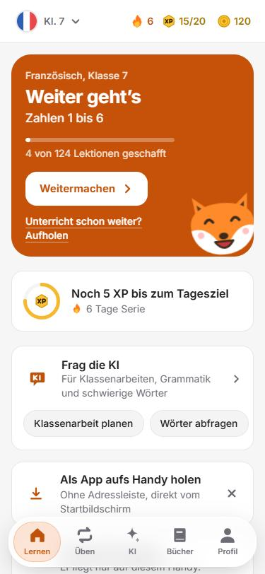
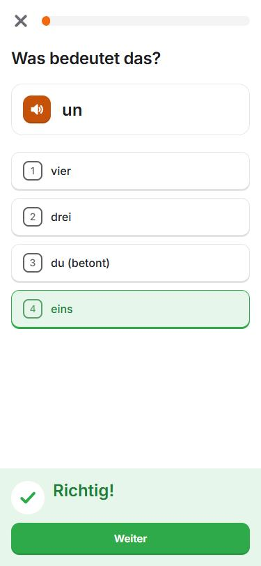
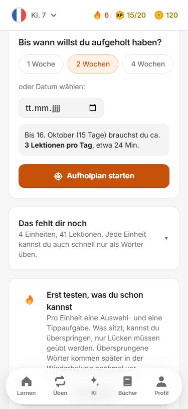
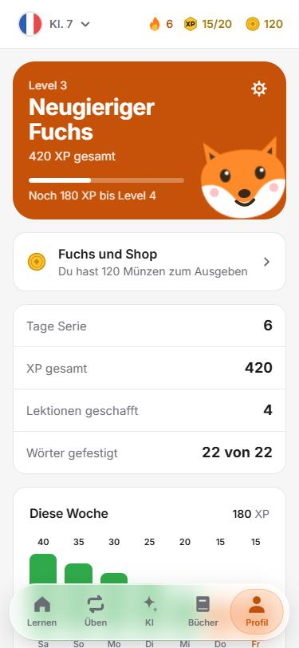

# Studienfuchs

**Französisch lernen für die Schule, Klasse 7 bis 10. Kostenlos, ohne Konto, direkt im Browser.**

Eine Lern-App im Stil moderner Sprach-Apps, aber gebaut für den Schulstoff: kleine Lektionen, die man schafft, Wörter, die wirklich hängen bleiben, und ein Aufholplan für alle, die im Unterricht den Anschluss verloren haben.

**[Jetzt ausprobieren: xdjmlx.github.io/studienfuchs](https://xdjmlx.github.io/studienfuchs/)**

<p align="center">
  
  
  
  
</p>

## Was die App kann

**Der Kurs**
- 4 Klassenstufen, 56 Einheiten, 393 Lektionen und 2.166 Wörter. Klasse 7 und 8 folgen den Themen von *À plus!* Band 1 und 2.
- Zu jedem Wort gibt es einen Beispielsatz mit Übersetzung und eine Aufnahme. Alle 4.384 Sprachdateien sind vorab mit dem Sprachmodell Piper erzeugt, die App klingt also auf jedem Gerät gleich.
- Neue Wörter kommen nur zu zweit und werden sofort abgefragt. Erst erkennen (auswählen, hören, zuordnen), dann aus Buchstaben legen, erst später frei schreiben.

**Lernen, das hängen bleibt**
- Abrufen statt Wiederlesen: Jede Lektion besteht aus aktiven Aufgaben.
- Wiederholungen plant **FSRS**, ein modernes Verfahren für wachsende Abstände. Die App zeigt, welche Wörter jetzt dran sind.
- Fehler kommen am Ende der Runde noch einmal. „Fast richtig" zählt halb.
- Die nächste Einheit öffnet erst, wenn die vorige gut geschafft ist. Raten bringt nichts.
- Tagesziel als Minimum: Wer es schafft, bekommt ein Bonusziel, ohne Strafe am nächsten Tag.

**Aufholen**
- Einheit wählen, die die Klasse gerade im Unterricht macht. Die App zeigt den Rückstand und macht einen Plan bis zu einem Wunschdatum, mit Lektionen pro Tag und Zeitbedarf.
- Ein Einstufungstest lässt überspringen, was schon sitzt. Übersprungene Wörter kommen in den nächsten Tagen zur Wiederholung.
- Auch frühere Klassen lassen sich nachholen, zum Beispiel für Quereinsteiger.

**Tests und KI**
- Kurztests (Deutsch links, Französisch rechts schreiben) direkt aus dem Kurs, ohne KI.
- Klassenarbeiten mit Hörverstehen, Wortschatz, Lückentext und Schreiben, von der KI erstellt, mit ungefährer Note.
- Eigene Schulbücher anlegen und Seiten fotografieren. Die Texterkennung läuft auf dem Gerät, die KI bekommt nur die passenden Seiten.
- Sprechtraining mit Spracherkennung und eine kleine Lautschule.

**Fuchs und Shop**
- Fürs Lernen gibt es Münzen. Damit kauft man Mütze, Brille und mehr, die der Fuchs überall in der App trägt.

## Gebaut für Handys
- Läuft im Browser und lässt sich als App aufs Handy holen (iPhone und Android).
- Schwebende Tab-Leiste, Fenster zum Wegwischen, keine Zoom-Sprünge beim Tippen.
- Heller und dunkler Modus, Bewegung reduziert sich bei entsprechender Systemeinstellung.
- Der Fortschritt bleibt auf dem Gerät. Wer das Handy wechselt, überträgt ihn über die Sicherung in den Einstellungen.

## Datenschutz
Kein Konto, keine Werbung, kein Tracking. Alles liegt im Browser des Geräts. Nur wenn man die KI benutzt, gehen die gesendeten Texte oder Fotos an den KI-Anbieter (Puter), und das nur beim Absenden.

## Technik
React 19, TypeScript, Vite, Tailwind CSS 4, Zustand, Framer Motion, `ts-fsrs`, Tesseract.js, Piper TTS, Vitest (133 Tests). Gehostet über GitHub Pages.

Mehr zur Lernmethode, zum Aufbau der Inhalte, zum Erzeugen der Aufnahmen und zum Entwickeln steht in der [technischen Doku](docs/ENTWICKLUNG.md).

```bash
npm install
npm run dev      # http://localhost:5173
npm test
npm run build
```
