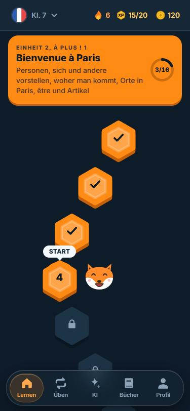
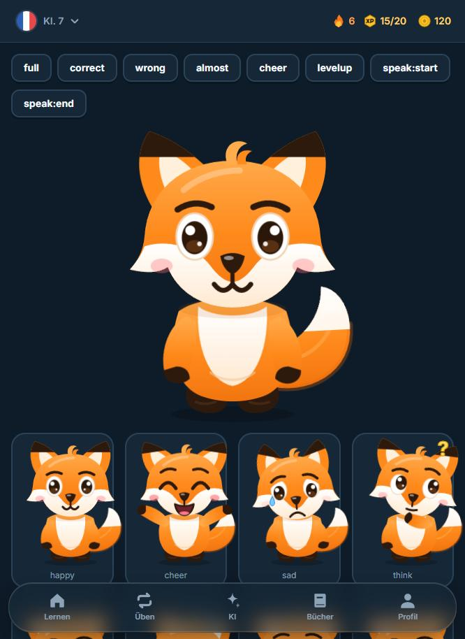

# Studienfuchs

**Üben für die Schule, in jedem Fach: Karteikarten, Wiederholung nach Plan, Arbeiten vorbereiten und KI-Hilfe. Kostenlos, ohne Konto, direkt im Browser.**

Eine Lern-App im Stil moderner Sprach-Apps, aber gebaut für den Schulstoff: kleine Lektionen, die man schafft, Wörter, die wirklich hängen bleiben, und ein Aufholplan für alle, die im Unterricht den Anschluss verloren haben.

**[Jetzt ausprobieren: xdjmlx.github.io/studienfuchs](https://xdjmlx.github.io/studienfuchs/)**

<p align="center">
  
  
  
  
  
</p>

## Was die App kann

**Dein Übungsplan für jedes Fach**
- Im Unterricht lernst du, hier übst du. Drei Tabs: **Üben**, **Kalender**, **Profil**. Die Fächer wählst du beim Start und änderst sie in den Einstellungen („Meine Fächer“).
- **Fächer:** Mathe, Deutsch, Englisch, Französisch, Biologie, Geschichte, Physik, Chemie, Geografie, Politik, Informatik, Kunst, Musik und ein freies Fach. Jedes Fach hat seine Karteikarten, seine Arbeiten und eine eigene KI-Hilfe.
- **Karteikarten erstellen:** Beschreibe, was du brauchst („Zellorganellen und ihre Aufgaben“, 20 Karten), und die KI macht die Karten, auch aus Fotos von Heft oder Arbeitsblatt. Ganz ohne KI geht „Aus Notizen“: Du fügst Heft-Text ein oder fotografierst ihn (die Texterkennung läuft auf dem Gerät), und die App macht aus Merksätzen („Die Zelle ist …“), Jahreszahlen und „Frage – Antwort“-Zeilen Kartenvorschläge. Oder schreib sie selbst, eine Karte pro Zeile (Frage – Antwort), auch aus einer Tabelle einfügbar. Vor dem Speichern prüfst und änderst du alles. Jeden Stapel kannst du per Link teilen (der Inhalt steckt im Link, kein Konto nötig): So kommen deine Karten aufs Handy oder zu Freunden.
- **Mehr als Karteikarten:** Die KI macht auf Wunsch auch **Quiz und Aufgaben**: Auswahlfragen, Richtig/Falsch, Lückentext, Zuordnen, Reihenfolge und Kurzantworten. Alles läuft mit den Karteikarten gemischt durch dieselbe Wiederholung. **Rechenaufgaben** (Mathe, Physik, Chemie) schreibt die KI nur als Rechnung („150/2“, „3x + 4 = 11“): Das Ergebnis berechnet die App selbst, exakt mit Brüchen, denn KI verrechnet sich oft. Unlösbare oder unklare Aufgaben werden aussortiert.
- **Tests, Klassenarbeiten, Vokabeltests (jedes Fach):** Von der KI aus Thema, Karteikarten oder Fotos (mit mehreren Teilen und Punkten, bei Rechenaufgaben von der App nachgerechnet) oder ohne KI aus den eigenen Karteikarten. Man macht sie ohne Hilfe und ohne Rückmeldung, mit Uhr; am Ende gibt es Punkte, eine ungefähre Note und alle Fehler mit Lösung. Kurzantworten bewertet man sich selbst anhand der Musterlösung (mit Vorschlag aus Stichwörtern). „Falsche üben“ macht aus den Fehlern ein Übungs-Set. Vokabeltests brauchen keine KI. Zu finden unter Üben → „Test oder Klassenarbeit“, auf jeder Fach-Seite und bei einer eingetragenen Arbeit („Probearbeit erstellen“).
- **Rechentraining ohne KI** (Physik, Chemie, Mathe): 12 Themen mit Formeln (Geschwindigkeit, Dichte, Druck, Ohmsches Gesetz, Stoffmenge, Massenanteil, Prozent, Dreisatz …), immer neue Aufgaben mit schönen Zahlen, Rechenweg bei Fehlern.
- **Üben:** Die Startseite zeigt, was heute dran ist, über alle Fächer: erst alles Fällige (kurz bevor du es vergessen würdest, geplant mit FSRS), dann neue Karten. Neue Karten kommen zu zweit und werden gleich abgefragt, danach erst mit Auswahl, später aus dem Gedächtnis (Tippen). Lange Antworten wie Definitionen werden nicht getippt, sondern als Karteikarte zum Umdrehen mit Selbstbewertung. Falsche Karten kommen nach ein paar anderen wieder.
- **Frei üben:** Erst ein Fach wählen (immer genau eins), dann ganzes Fach oder ein Stapel, dann die Art: Gemischt, Karteikarten, Tippen; bei Französisch auch Schreiben, Hören und Sprechen.
- **Kalender:** Ein ruhiger Monat für Arbeiten, Tests und Hausaufgaben (Arbeit = ausgefüllter Punkt in der Fachfarbe, Hausaufgabe = Ring). Ein Tipp auf einen Tag zeigt, was da fällig ist; das Plus fragt, ob es eine Arbeit oder eine Hausaufgabe ist. Bei einer Arbeit wählst du die Karteikarten, und die App verteilt sie auf die Tage bis dahin. Nach dem Termin trägst du die Note ein (Münzen fürs Eintragen).
- **Schneller eintragen:** Hausaufgaben und Arbeiten in einem Satz („Bio Test Zelle 15.10.“, „Mathe S. 52 bis morgen“). Wie viel das spart, steht in `docs/MESSUNG.md` (im Mittel etwa 55 % weniger Tippen).
- **Hausaufgaben:** Eigener Tab, eintragen in einem Satz („Mathe S. 52 bis morgen“, Fach und Tag werden erkannt): Was ist zu tun, in welchem Fach, bis wann. Sortiert nach Fälligkeit (überfällig, heute, morgen, diese Woche, später), mit Kreis zum Abhaken; am Tab steht, wie viele heute oder früher fällig sind. Erledigte sind eingeklappt.
- **Schulstunden (optional):** In den Einstellungen trägst du ein, wann deine Stunden anfangen und enden. Beim Eintragen einer Arbeit wählst du dann „3. Stunde“ statt einer Uhrzeit.
- **Gefühl:** Jeder Knopf federt auf seine Art zurück (Knöpfe quetschen und überschwingen, Auswahl wackelt, Karten rucken, runde Knöpfe drehen), die Tab-Leiste hat eine Gummi-Linse, Seiten schieben sich mit leichter Bewegungsunschärfe herein, Karteikarten drehen sich mit Schwung, richtige Antworten federn, falsche schütteln sich. Bei „Bewegung reduzieren“ in den Systemeinstellungen bleibt alles ruhig.
- **Übersichtlich:** Üben zeigt eine Hauptkarte („Heute dran“ mit einem Knopf), darunter die nächsten zwei Arbeiten und eine kurze Liste (Frei üben, Blitzrunde, Probearbeit, Neu erstellen). Alles ist flach und ruhig gestaltet, jede Seite hat eine große Überschrift. Jedes Fach hat drei Bereiche (Karteikarten, Tests, Mehr), die Einstellungen sind eine Liste mit eigenen Seiten, das Profil zeigt nur das Wichtigste. Beim Erstellen wählst du zuerst, was es sein soll (Karteikarten, Quiz & Aufgaben, Rechenaufgaben, Test), und siehst nur dazu passende Optionen.
- **Dein Lerntier:** Zwölf Tiere zum Aussuchen (Fuchs, Elefant, Krokodil, Giraffe, Erdmännchen, Löwe, Panda, Pinguin, Nilpferd, Zebra, Affe, Tiger), alle mit denselben Reaktionen. Zubehör aus dem Laden passt auf jedes.
- **Fehler melden:** Unter Einstellungen → Fehler melden und Ideen; man sieht vor dem Senden, was mitgeschickt wird. Anonyme Nutzungsdaten sind freiwillig und standardmäßig aus.
- **Einrichtung in drei Bildschirmen:** Start, Klasse und Fächer, erste Karteikarten. Auf dem letzten tippst du ein Thema an (Vorschläge passend zu Fach und Klasse), schreibst selbst oder fotografierst dein Heft; die KI macht die Karten, du siehst sie kurz an und startest gleich die erste Runde. Das Lerntier wechselst du schon auf dem Startbildschirm, die Einführung („So funktioniert’s“) gibt es auf Wunsch. Lernzeit und Schulstunden stehen später in den Einstellungen.
- **KI einschalten:** Vor der ersten KI-Nutzung erklärt ein Fenster in drei Zeilen, was passiert, führt durch das Fenster von Puter und hilft bei blockierten Pop-ups oder abgebrochener Anmeldung (mit „Nochmal versuchen“, „Ohne KI weitermachen“ und dem Weg zu einem eigenen Schlüssel).
- **Bessere KI-Klassenarbeiten:** Die KI kennt Klassenstufe und Schwierigkeit, baut die Arbeit wie eine Lehrkraft in diesem Fach auf (z. B. Lesetext mit Fragen in Deutsch und Englisch, Quelle in Geschichte, Rechnen in Mathe), schreibt Lesetexte als Teil der Arbeit und ordnet Aufgaben Anforderungsbereichen zu (Wissen, Anwenden, Begründen). Ist die erste Antwort zu dünn, fragt die App einmal nach. Vor dem Start kannst du Aufgaben aussortieren; am Ende zeigt die Auswertung, wo du stehst.
- **Level, Sterne, Meilensteine:** Jedes Fach hat ein Level (je mehr Karten sitzen, desto höher), jeder Stapel bis zu drei Sterne. Nach jeder Runde zeigt „Das hat sich getan“, was neu gelernt wurde und jetzt sitzt, und feiert Level, Sterne und Marken einer Arbeit (25, 50, 75, 100 %) mit Münzen.
- **Probearbeit:** Zu jeder eingetragenen Arbeit gibt es eine Probearbeit: 15 Karten aus dem ganzen Stoff, nichts wird vorher gezeigt, Fehler kommen nicht wieder, am Ende steht eine ungefähre Note.
- **Fertige Karteikarten:** Für Mathe, Deutsch, Englisch, Biologie, Physik, Chemie, Geografie, Geschichte, Politik, Informatik, Musik und Kunst gibt es 16 Sätze von Karteikarten mit Grundwissen zum Hinzufügen (Formeln, Hauptstädte, Zelle, Stilmittel …), die man danach bearbeiten kann. In Mathe gibt es außerdem ein Rechentraining mit 43 Themen, deren Aufgaben sich selbst erzeugen.
- **Arbeiten:** Trag eine Arbeit mit Datum und den Stapeln ein, die dafür gelernt werden. Die App verteilt die neuen Karten so auf die Tage, dass bis zum Vortag alles einmal gesehen wurde, und zeigt, wie viele Karten schon sitzen. Der letzte Tag bleibt zum Wiederholen frei.
- **Vokabeln:** Stapel mit Sprache (Französisch, Englisch) lesen vor, bieten Sonderzeichen beim Tippen und fragen auch rückwärts.
- **Französisch** bringt außerdem fertige Stapel aus dem Kurs mit (Klasse 7 bis 10, nach *À plus!* und *Découvertes*, mit Beispielsätzen und Aufnahmen), ein Wörterbuch und Grammatik zum Nachschlagen. Einheiten, die ihr im Unterricht durchnehmt, fügst du zum Üben hinzu.

**Tests und KI**
- Kurztests (Deutsch links, Französisch rechts schreiben) direkt aus dem Kurs, ohne KI.
- Klassenarbeiten mit Hörverstehen, Wortschatz, Lückentext und Schreiben, von der KI erstellt, mit ungefährer Note.
- Eigene Schulbücher anlegen und Seiten fotografieren. Die Texterkennung läuft auf dem Gerät, die KI bekommt nur die passenden Seiten.
- Sprechtraining mit Spracherkennung und eine kleine Lautschule.

**Jeden Tag ein Grund wiederzukommen**
- **Lernzeit statt Tagesziel:** Ohne Arbeit gibt es kein Tagesziel, du übst, wann du willst. Steht eine Arbeit mit Karteikarten an, zeigt die Startseite die Minuten von heute (Standard 10, in den Einstellungen 5 bis 20). Es gibt keine Serie, keine Tagesaufgaben und keine Truhe.
- Die Blitzrunde: 60 Sekunden, so viele Karten wie möglich, mit Combo-Faktor bis ×4 und eigenem Rekord.
- Neue Erfolge, eine geschaffte Einheit („Das kannst du jetzt: …“) und gute Reihen werden gefeiert. Die Töne werden mit jeder richtigen Antwort höher.
- Alles ohne Strafen: Wer einen Tag auslässt, verpasst nur die Extras dieses Tages.

**Fenni, der Fuchs**
<p align="center"></p>

- Der Fuchs ist komplett selbst gezeichnet und besteht aus einzelnen Teilen, die sich bewegen: Er atmet, blinzelt, wedelt mit dem Schwanz, zuckt mit den Ohren und schaut sich ab und zu um.
- Er reagiert auf das, was du machst: Bei richtigen Antworten hüpft er, bei falschen wird er traurig und schüttelt den Kopf, bei vielen richtigen Antworten in Folge jubelt er, bei einer neuen Stufe tanzt er. Wenn eine Vokabel vorgelesen wird, bewegt er den Mund nach der echten Lautstärke der Aufnahme mit. Mund und Augen werden aus Zahlen gezeichnet und gleiten weich von einer Stimmung zur nächsten.
- Der Körper bewegt sich mit Federphysik statt festen Animationen: Ohren, Arme und Schwanz schwingen nach, er geht beim Hüpfen erst in die Knie, fliegt in einer Bogenbahn und staucht sich beim Landen. Jeder Ablauf ist ein eigener Federzustand und lässt sich mitten in der Bewegung unterbrechen.
- Er kennt 14 Posen (froh, jubelnd, traurig, nachdenklich, winkend, schlafend, überrascht, verliebt, zwinkernd, lachend, gähnend, tanzend, stolz, entschlossen). Wichtigere Reaktionen unterbrechen unwichtigere.
- Tippen auf den Fuchs bringt ihn zum Winken, Staunen, Zwinkern oder Lachen. Wer ihn lange nicht anfasst, sieht ihn einschlafen.
- Fürs Lernen gibt es Münzen. Damit kauft man Mütze, Brille und mehr, die der Fuchs überall in der App trägt.

## Gebaut für Handys
- Läuft im Browser und lässt sich als App aufs Handy holen (iPhone und Android).
- Schwebende Tab-Leiste, Fenster zum Wegwischen, keine Zoom-Sprünge beim Tippen.
- Heller und dunkler Modus, Bewegung reduziert sich bei entsprechender Systemeinstellung.
- Der Fortschritt bleibt auf dem Gerät. Wer das Handy wechselt, überträgt ihn über die Sicherung in den Einstellungen.

## Datenschutz
Kein Konto, keine Werbung, kein Tracking. Alles liegt im Browser des Geräts. Nur wenn man die KI benutzt, gehen die gesendeten Texte oder Fotos an den KI-Anbieter (Puter), und das nur beim Absenden.

## Technik
React 19, TypeScript, Vite, Tailwind CSS 4, Zustand, Framer Motion, `ts-fsrs`, Tesseract.js, Piper TTS, Vitest und Testing Library (über 400 Tests, darunter ganze Übungsrunden und Bedienabläufe). Gehostet über GitHub Pages.

Mehr zur Lernmethode, zum Aufbau der Inhalte, zum Erzeugen der Aufnahmen und zum Entwickeln steht in der [technischen Doku](docs/ENTWICKLUNG.md). Was vor einer öffentlichen Veröffentlichung zu tun ist, steht in der [Checkliste](docs/VEROEFFENTLICHUNG.md).

```bash
npm install
npm run dev      # http://localhost:5173
npm test
npm run build
```

## Lizenz
Alle Rechte vorbehalten (siehe [LICENSE](LICENSE)). Den Quelltext, die Inhalte, das Maskottchen und die Aufnahmen darf ohne Erlaubnis niemand kopieren oder weiterverwenden. Die App selbst darf jede und jeder im Browser benutzen. Hinweis: Auf GitHub kann jeder ein öffentliches Repository ansehen und forken; das regelt GitHub, die Lizenz schränkt die Nutzung trotzdem ein. Soll auch der Quelltext nicht sichtbar sein, muss das Repository privat werden (GitHub Pages braucht dafür einen bezahlten Tarif).
